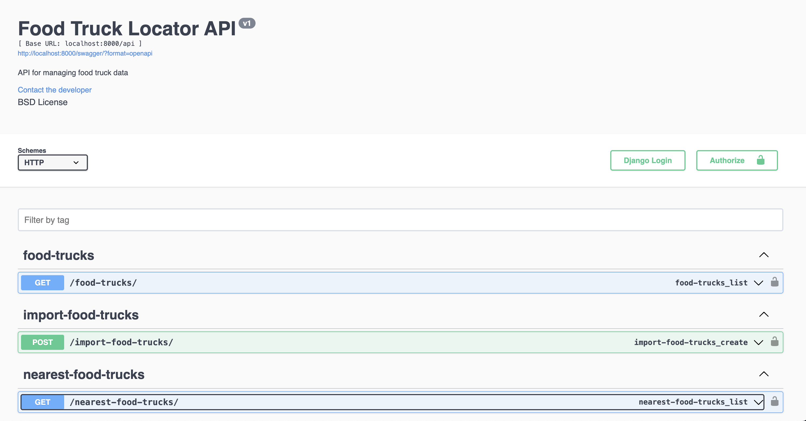

# RAKT's "Out-of-the-Box" Engineering Challenge

## Description
The Problem : World Needs More Food Trucks!

Our team in San Francisco are on a quest to discover the hidden gems of street food, particularly food trucks! Your challenge is to to make it possible for us to find a food truck no matter where our work takes us in the city.

The only requirement for the assignment is that it give us at least 5 food trucks to choose from a particular latitude and longitude.


## Installation

1. Clone the repository:
   ```bash
   git clone git@github.com:ifreitz/food-track-locator.git
   cd food-track-locator
   ```

2. Create a virtual environment (optional if using Docker):
   ```bash
   virtualenv venv
   ```

3. Activate the virtual environment (optional if using Docker):
   - On Windows:
     ```bash
     venv\Scripts\activate
     ```
   - On macOS and Linux:
     ```bash
     source venv/bin/activate
     ```

4. Install the required packages (optional if using Docker):
   ```bash
   pip install -r requirements.txt
   ```

5. Run migrations (optional if using Docker):
   ```bash
   python manage.py migrate
   ```

6. Start the development server (optional if using Docker):
   ```bash
   python manage.py runserver
   ```

## Running with Docker

1. **Build the Docker containers**:
   ```bash
   docker-compose build
   ```

2. **Start the containers**:
   ```bash
   docker-compose up
   ```

3. **Access the application**: 
   Visit `http://localhost:8000/` in your web browser to see the application in action.

4. **Run in detached mode (optional)**:
   If you want to run the containers in the background, you can use:
   ```bash
   docker-compose up -d
   ```

5. **Stop the containers**:
   To stop the running containers, use:
   ```bash
   docker-compose down
   ```

## Database Setup

1. Install PostgreSQL on your machine (if not using Docker).
2. Create a new database:
   ```bash
   createdb fooddb
   ```
3. Create a new user and grant privileges:
   ```sql
   CREATE USER fooddb_user WITH PASSWORD 'fooddb_password';
   GRANT ALL PRIVILEGES ON DATABASE fooddb TO fooddb_user;
   ```

## How to test

1. Open the Swagger UI at `http://localhost:8000/swagger/`
2. Click on the `Import Food Trucks` endpoint to import the food trucks data.
3. Click on the `Food Truck List` endpoint to see the food trucks data.
4. Click on the `Nearest Food Trucks` endpoint to see the nearest food trucks data.

